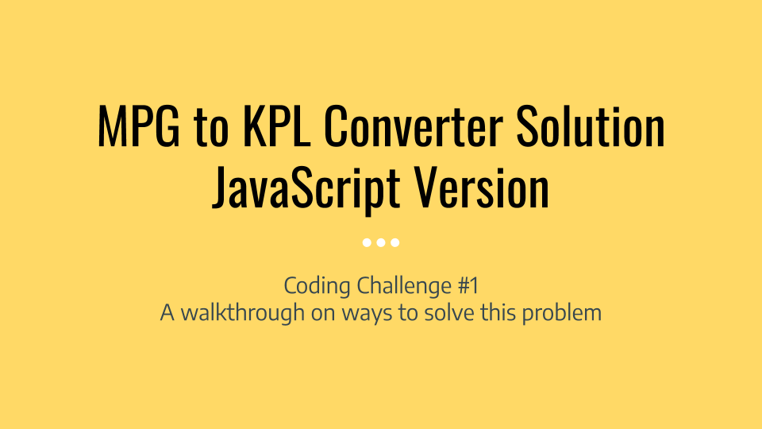
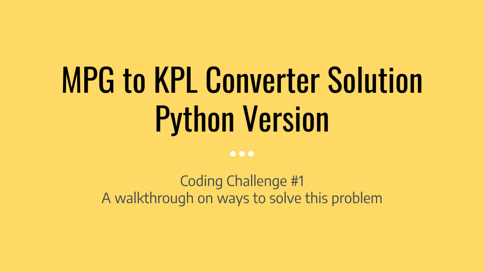

# My Code Portfolio

Here is a small sample of some of the coding projects that I've created:

## MPG to KPL Converter

This is a small, introductory program that I wrote to learn how to achieve input/output on the command line and to write a simple function. I implemented this project twice with both JavaScript and Python.

* [Link to the Python version of my MPG to KPL converter](https://github.com/morphatic/mpg2kpl-python)
* [Link to the JavaScript version of my MPG to KPL converter](https://github.com/morphatic/mpg2kpl-js)

I also made some videos of myself while coding to demonstrate my coding process.

